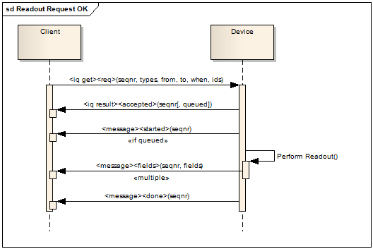

**XMPP** is an excellent protocol for use within *Internet of Things*. The aim of this page, is to give a brief introduction to how XMPP can help build solid, secure and interoperable devices, services and applications for the *Internet of Things*.

## A definition for the Internet of Things

While early pioneers into the field later named *Internet of Things*, or **IoT**, were quick to outline their visions of what the Internet of Things could become, the subject has lacked a clear *definition* of what it is, a definition with clear ramifications and consequences that can be studied, and under which different solutions can be compared. Before we embark on the journey of making claims of which protocol is the best for IoT, or if a protocol is good or bad at all, we need to establish some common ground. We therefore make the following definition:

| Internet of Things |
|--------------------|
|The *Internet of Things* (or **IoT**) is what we get when we *connect* *Things*, that are *not operated by humans*, to the *Internet*. |

This definition has some direct consequences that open up into different areas of study:

* **Connection** relates to the study of *communication protocols*.
* **Things** relates to the study of *sensors*, *actuators*, *controllers* and other types of devices.
* **Not operated by humans** relates to *provisioning* and *automatic decision making*.
* **Internet** relates to *scalability* and *security*, including identities, authentication and authorization, but also to *interoperability*.

As you will see, **XMPP** provides a lot of support into all these areas, making it well suited for use withing the area of *Internet of Things*.

## Communication Protocols

One important aspect of **IoT** is how things connect to the Internet and how they can communicate with the outside world, and how the outside world in turn can communicate with the things. XMPP provides a stable and well tested extensible protocol that gives exceptional possibilities both to things and any applications wanting to communicate with them. The following subsections will outline why that is.

### Connection Bindings

When things and applications connect to the Internet using **XMPP**, they need to connect to the XMPP network using a **binding**. There are various options available, depending on the capabilities of the broker used to connect to the network.

#### Standard XMPP binding

This binding mechanism allows things to connect to the network using a normal bi-directional socket connection to the server. XML fragments are later sent both ways over this socket connection as part of the communication. This method is clearly outlined in the XMPP RFCs [RFC 6120](https://tools.ietf.org/html/rfc6120), [RFC 6121](https://tools.ietf.org/html/rfc6121) and [RFC 6122](https://tools.ietf.org/html/rfc6122).

#### BOSH - Bidirectional streams over Synchronous HTTP

This binding mechanism allows clients that can only access the Internet using the HTTP protocol series (such as Javascript clients) to connect to the XMPP network. **BOSH** is described in [XEP-0206: XMPP Over BOSH](http://xmpp.org/extensions/xep-0206.html).

#### EXI - Efficient XML Interchange

For small devices in resource constrained networks, XMPP can seem to verbose. Often network packets have to be small to not be fragmented, such as is the case if using 6LowPan IPv6 radio networks. To allow such devices to use the powers of XMPP, an **EXI** binding is available. EXI, or Efficiant XML Interchange, is an exceptionally efficient way of compressing XML, using knowledge derived from the XML schemas, and allows XML fragments to be compressed to sizes suitable for resource contrained networks. **EXI** binding is described in [XEP-0322: Efficient XML Interchange (EXI) Format](http://xmpp.org/extensions/xep-0322.html). 

## Communication Patterns

*Communication patterns* are architectorial concepts describing how messages are transported in the network to accomplish certain tasks. Knowledge of these patterns are important to be able to correctly design and implement applications and scale networks of things accordingly, so that functional and performance requirements are met.

#### Request/Response

The **Request/Response** communication pattern is one of the most basic communication patterns. It allows a *client* to request information from a *server* in *real-time*. The words "client" and "server" are here used purely to illustrate the roles of the participants in the pattern, not to describe the hierarchy in the network. Most commonly, they are peers in the network.

XMPP provides an intrinsic method to implement a generic Request/Response mechanism, by use of the **iq** stanza built into XMPP. This allows one client to request information from another. What information is defined by the contents of the **iq** stanza.

For proprietary applications in IoT, the **iq** stanza might be sufficient. But there are instances where it is not. One such instance is if the response is slow to be collected, and partial results have to be returned to show progress. This might be the case when communicating with devices behind gateways, behind which very slow communication protocols are used. Another important instance, is if [interoperable](#interoperability) solutions are desired. In such cases, proprietary solutions create walled gardens that are difficult to integrate in larger contexts.

To facilitate the creation of an *open* and [loosely coupled](#loosely-coupled-architectures) architecture that enable [interoperability](#interoperability) between things and applications, [XEP-0323: Internet of Things - Sensor Data](http://xmpp.org/extensions/xep-0323.html) was created. It defines a Request/Response mechanism where sensor data can be read from devices asynchronously. Apart from the normal request/response mechanism provided by the **iq** stanza, it allows for slow responders and defines a data format that can be used to encapsulate sensor data in an interoperable manner. It is designed to allow new types of devices to be added to networks without the need to upgrading software to perform basic tasks, such as sensor data readout, machine processing of data and presentation of data to human users. It also allows devices from different manufacturers and applications from different developers to exchange data seemlessly.

 
* Example of normal Request/Response flow in [XEP-0323](http://xmpp.org/extensions/xep-0323.html)

#### Asynchronous Messaging

#### Publish/Subscribe

#### Event subscription (Observe)

#### Delayed delivery

### Quality of Service

## Scalability

### Federation

### Global identity

## Things

### Sensors

### Actuators

### Controllers

### Concentrators

## Provisioning

### Delegation of Trust

### Discovery

## Security

### Identity

### Authentication

### Authorization

### Encryption

### End-to-end encryption

## Interoperability

### Loosely coupled architectures

### Standard interfaces

## Work in progress

## For more information
